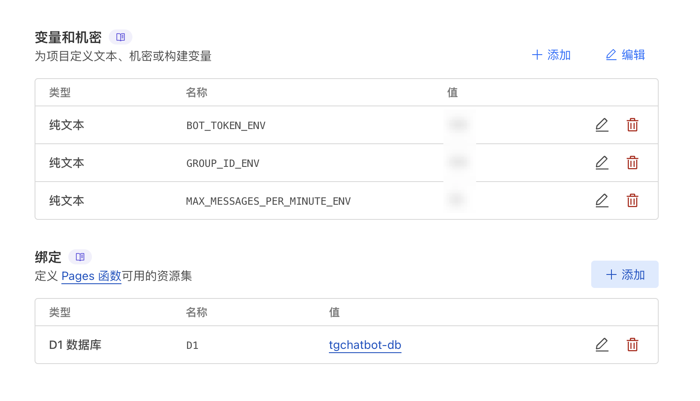

# TGChatBot - Telegram消息转发机器人

> 基于Cloudflare的Telegram消息转发分组对话机器人，零成本运行，自由可控，由凉心根据自己需求进行二次开发自用

## 📑 目录

- [✨ 核心功能](#-核心功能)
- [🚀 快速部署](#-快速部署)
  - [前提条件](#前提条件)
  - [部署到Cloudflare Pages](#部署到cloudflare-pages)
  - [部署到Cloudflare Workers](#部署到cloudflare-workers)
- [📋 配置参数说明](#-配置参数说明)
- [🙏 致谢](#-致谢)

## ✨ 核心功能

### 1. 零成本运行
- 完全基于**Cloudflare Workers**部署，利用免费额度（每天10万次请求）
- 使用**Cloudflare D1**存储数据，免费额度（每天10万次读/写）足够日常使用
- 自托管开源方案，避免受第三方控制，无广告，可自由修改

### 2. 分组对话管理
- 用户私聊机器人的消息自动转发到后台群组的子论坛，实现便捷客服管理
- 支持多账号回复（只需将账号拉进群并设置为管理员）
- 置顶消息自动显示用户信息（昵称、用户名、ID、时间）
- 每个用户独立一个分组，对话组织清晰

### 3. 安全机制
- 按钮式验证码（简单数学题）防止垃圾消息
- 验证状态持久化（1小时有效），提升用户体验
- 消息频率限制保护，防止恶意刷屏

### 4. 管理功能
- 管理员命令：`/block`（拉黑）、`/unblock`（解除）、`/checkblock`（检查）
- 直接在群组回复用户消息，无需切换界面

### 5. 轻量级部署
- 单文件部署，代码简洁易维护
- 支持Pages和Workers两种部署方式，Pages部署尤为简单

## 🚀 快速部署

### 前提条件

1. **创建Telegram Bot**
   - 联系`@BotFather`，发送`/newbot`创建机器人
   - 获取Bot Token（形如`123456:ABC-DEF1234ghIkl-zyx57W2v1u123ew11`）
   - 发送`/setinline`启用内联模式

2. **创建后台群组**
   - 创建Telegram群组（公开或私有均可）
   - 开启群组的"话题功能"
   - 将机器人添加为管理员（建议给予消息管理、话题管理权限）
   - 获取群组ID（形如`-100123456789`，可通过`@getidsbot`获取）

### 部署到Cloudflare Pages

1. **Fork本项目**到您的GitHub账户

2. **创建D1数据库**
   - 登录[Cloudflare仪表板](https://dash.cloudflare.com/)
   - 进入**存储和数据库 > D1 SQL数据库**
   - 输入名称（如`tgchatbot-db`）并创建

3. **创建Pages项目**
   - 进入**Workers和Pages > Pages**
   - 点击**创建应用程序**
   - 选择**连接到Git**，关联您fork的仓库

4. **配置环境变量**
   - 在项目**设置 > 环境变量**中添加：
     - `BOT_TOKEN_ENV`: 您的Bot Token
     - `GROUP_ID_ENV`: 后台群组ID
     - `MAX_MESSAGES_PER_MINUTE_ENV`: 消息频率限制（建议: `30`）

   

5. **绑定D1数据库**
   - 在项目**设置 > 函数 > D1数据库绑定**中：
   - 添加变量名称：`D1`
   - 选择刚创建的数据库

6. **重新部署并测试**
   - 点击**部署 > 重试部署**
   - 部署成功后，访问您的机器人，发送`/start`开始测试

### 部署到Cloudflare Workers

1. **创建D1数据库**（`tgchatbot-db`）

2. **创建Workers项目**
   - 进入**Workers和Pages > Workers**
   - 创建新的Worker（如`tgchatbot`）

3. **配置环境变量**
   - `BOT_TOKEN_ENV`: Bot Token
   - `GROUP_ID_ENV`: 群组ID
   - `MAX_MESSAGES_PER_MINUTE_ENV`: `30`

4. **绑定D1数据库**（变量名`D1`）

5. **部署代码**
   - 将本项目`_worker.js`代码复制到Workers编辑器
   - 保存并部署

## 📋 配置参数说明

| **参数名** | **类型** | **描述** | **示例值** |
|------------|----------|----------|------------|
| `BOT_TOKEN_ENV` | 环境变量 | Telegram Bot Token | `123456:ABC-DEF1234...` |
| `GROUP_ID_ENV` | 环境变量 | 后台群组ID | `-100123456789` |
| `MAX_MESSAGES_PER_MINUTE_ENV` | 环境变量 | 消息频率限制 | `30` |
| `D1` | 数据库绑定 | Cloudflare D1数据库 | `tgchatbot-db` |

## 🙏 致谢

- 特别感谢 [CFTeleTrans (CTT)](https://github.com/iawooo/ctt) 提供的开源代码和灵感